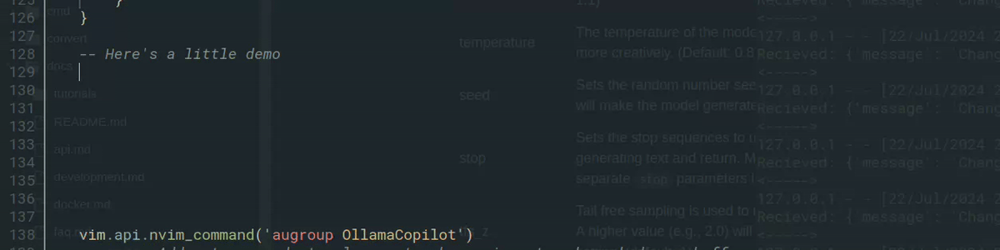

# Ollama Copilot



## Overview
### Copilot-like Tab Completion for NeoVim
Ollama Copilot allows users to integrate their Ollama code completion models into Neovim, giving GitHub Copilot-like tab completions.  
  
Offers **Suggestion Streaming** which will stream the completions into your editor as they are generated from the model.

### Optimizations:
- [x] Debouncing for subsequent completion requests to avoid overflows of Ollama requests which lead to CPU over-utilization.
- [x] Full control over triggers, using textChange events instead of Neovim client requests.
### Features
- [x] Language server which can provide code completions from an Ollama model
- [x] Ghost text completions which can be inserted into the editor
- [x] Streamed ghost text completions which populate in real-time


## Install
### Requires
To use Ollama-Copilot, you need to have Ollama installed [github.com/ollama/ollama](https://github.com/ollama/ollama):  
```bash
curl -fsSL https://ollama.com/install.sh | sh
```
Also, the language server runs on Python, and requires two libraries (Can also be found in python/requirements.txt)
```bash
pip install pygls ollama
```
Make sure you have the model you want to use installed, a catalog can be found here: [ollama.com/library](https://ollama.com/library?q=code)
```
# To view your available models:
ollama ls

# To pull a new model
ollama pull <Model name>
```
### Using a plugin manager
Lazy:
```lua
-- Default configuration
{"Jacob411/Ollama-Copilot", opts={}}
```
```lua
-- Custom configuration (defaults shown)
{
  'jacob411/Ollama-Copilot',
  opts = {
    model_name = "deepseek-coder:base",
    ollama_url = "http://localhost:11434", -- URL for Ollama server, Leave blank to use default local instance.
    stream_suggestion = false,
    python_command = "python3",
    filetypes = {'python', 'lua','vim', "markdown"},
    ollama_model_opts = {
        num_predict = 40,
        temperature = 0.1,
    },
    keymaps = {
        suggestion = '<leader>os',
        reject = '<leader>or',
        insert_accept = '<Tab>',
    },
}
},
```
For more Ollama customization, see [github.com/ollama/ollama/blob/main/docs/modelfile.md](https://github.com/ollama/ollama/blob/main/docs/modelfile.md)

## Usage
Ollama copilot language server will attach when you enter a buffer and can be viewed using:
```lua
:LspInfo
```
### Recomendations
Smaller models (<3 billion parameters) work best for tab completion tasks, providing low latency and minimal CPU usage.
- [deepseek-coder](https://ollama.com/library/deepseek-coder:1.3b) - 1.3B
- [starcoder](https://ollama.com/library/starcoder:1b) - 1B
- [codegemma](https://ollama.com/library/codegemma:2b) - 2B
- [starcoder2](https://ollama.com/library/starcoder2:3b) - 3B
  
## Contributing
Contributions are welcome! If you have any ideas for new features, improvements, or bug fixes, please open an issue or submit a pull request.

I am hopeful to add more on the model side as well, as I am interested in finetuning the models and implementing RAG techniques, moving outside of using just Ollama.

## License
This project is licensed under the MIT License.

